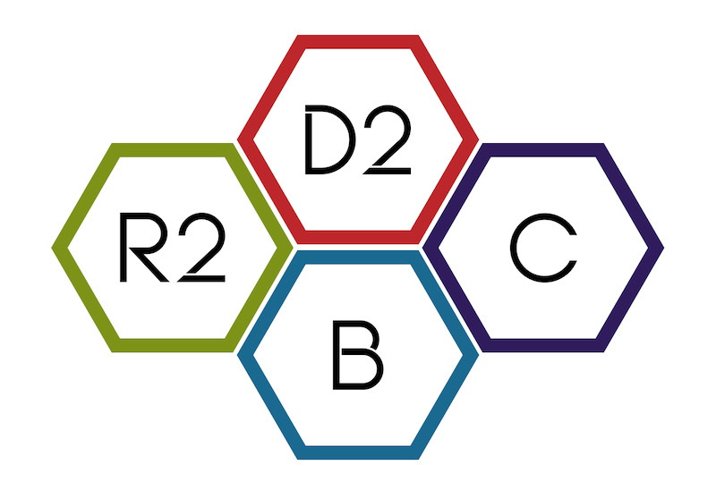

[](https://join.slack.com/t/r2d2bc/shared_invite/zt-gisndbu8-ecMkJ3Z1tZL8QU7_x5eLRA)

# R2D2BC

# Introduction
**R2D2BC** is an implementation of the [Readium v2](https://github.com/readium/architecture) EPUB reader for the web.
It is built as a modular toolkit (rather than a full-featured app) so that applications can use it to 
handle the EPUB-related functions while customizing the own design, user interface, and extensions.

# Goals

- Follow the Readium architecture specification for best interoperability
- Allow maximum configurability via API methods, callbacks, code and style injection, and clear separation of functions.
- Modularity 
- Clarity of code and ease of maintenance
- Speed
- Accessibility
- Free and open source

The R2D2BC project intentionally includes only a base-bones demonstration user interface, and no sample content.
Any implementer can add their own functionality and design without refactoring the whole project.

See below for projects that provide the necessary other elements to try it out and see it in action.

# Architecture

This project implements most components of the [Readium Architecture](https://github.com/readium/architecture):

- Implements Locator
- Implements UserSettings
- Implements Webpub Manifest
- Implements the Readium shared models
- Integrates Readium CSS
- Integrates a simple Navigator for reflowable publications

Additionally, it:
- Provides a decoupled Minimal UI
- Provides build system optimization (Webpack)

# Origins

Here is the original proposal, initiated by Aferdita Muriqi to the
[Readium Weekly Eng Meeting - 05/22/2019](https://docs.google.com/document/d/1krNe8TUtvajpljcSS4nN_2cHfWO4_Hsag5LnJ4hj_CM/edit#)

Subsequent development of R2D2BC has been supported by [DITA](https://github.com/d-i-t-a), [Bokbasen](https://www.bokbasen.no/), and [CAST](http://www.cast.org) - which explains the D2, B, and C in the name.

# Features & Functionalities
- ePub Reflowable + Fixed Layout
- Reader Settings
- Configurable Modules with Callbacks
- Injectable Fonts, CSS, Javascript
- Text Selection with Injectable Context Menu
- Bookmarks
- Highlights
- Annotations
- TTS - Text to speech / Read Aloud
- Media Overlays - Read Along
- Search
- Content Protection
- Definitions
- Popup Footnotes
- Page Breaks - Page Numbers in margin
- Sample Read
- Timeline
- Layers
- Line Focus (Beta Feature)
- Popups and Popovers

# Extensions and Implementations

The R2D2BC reader has been used in:
- The [Clusive](https://github.com/cast-org/clusive) learning environment
- Bokbasen's [Allbok.no](https://www.allbok.no) 
- Allvir's [Allvit.no](https://www.allvit.no) Reading Platform
- The UNODC [Fieldguides](https://fieldguides.github.io/library)
- The DITA Gateway [D2G](https://d2g.dita.digital) with several open collections
- [Ekitabu's](https://d2g.dita.digital) Web Reader Implementations through Dita Gateway
- [NYPL's](https://www.nypl.org/) Web Reader Implementations
- Bibliotheca's [CloudLibrary](https://www.yourcloudlibrary.com) as Sample Reader and Full ePub Reader
- Above the Treeline's [Edeweiss+](https://www.edelweiss.plus) 
- [Bluefire's](https://www.bluefirereader.com) Web Reader Implementations
- In a Project in the Meta Verse (to be named once public)
- and a few more... :) 


# Contributing
Contributions are always welcomed! Please see [CONTRIBUTING](CONTRIBUTING.md) for detailed guidelines.

[](https://depshield.github.io)

# Get Started

Download ebook examples here: https://standardebooks.org/ebooks and copy them to `./examples/epubs`. Then:

```
npm install

npm run build && npm run examples
```
Then visit `http://localhost:4444/`. Follow the prompts to view example apps.

### WIKI
- [Implementation Guides and Examples](https://github.com/d-i-t-a/R2D2BC/wiki)

### Migration Guides
- [Version 1.x -> 2.x](MIGRATION.md)
### Change Log
- [2.0.x](CHANGELOG.md)

## Supporters
[](https://www.jetbrains.com/?from=R2D2BC)
