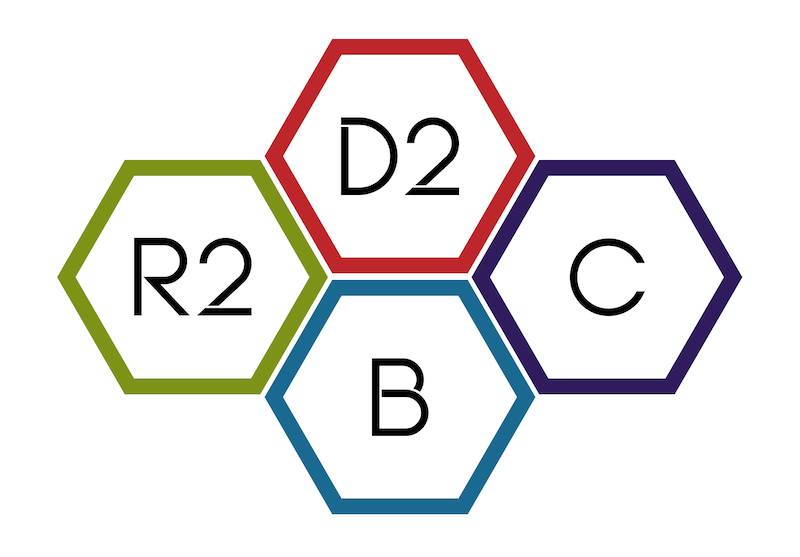

# DITA Toolkit

> Formerly known as **R2D2BC**. The GitHub repository (`d-i-t-a/R2D2BC`), the npm package (`@d-i-t-a/reader`), and the `D2Reader` class name are unchanged.

## Introduction
**DITA Toolkit** is an implementation of the [Readium v2](https://github.com/readium/architecture) EPUB, PDF, and Audiobook reader for the web.
It is built as a modular toolkit (rather than a full-featured app) so that applications can use it to
handle publication-related functions while customizing their own design, user interface, and extensions.

## Goals

- Follow the Readium architecture specification for best interoperability
- Allow maximum configurability via API methods, callbacks, code and style injection, and clear separation of functions
- Modularity
- Clarity of code and ease of maintenance
- Speed
- Accessibility
- Free and open source

The project intentionally includes only a bare-bones demonstration user interface, and no sample content.
Any implementer can add their own functionality and design without refactoring the whole project.

## Features

- EPUB Reflowable + Fixed Layout
- PDF (via pdfjs-dist v5)
- Audiobook (Readium Audiobook Profile)
- RTL paginated + scroll (Arabic, Hebrew, RTL CJK)
- CJK vertical (Japanese tategaki, vertical Chinese) and Mongolian vertical
- ReadiumCSS v1 and v2 supported simultaneously
- Direct EPUB / Blob / File opening (client-side parsing with font deobfuscation)
- Reader Settings (font, size, spacing, colors, layout, margins)
- Configurable Modules with Callbacks
- Injectable Fonts, CSS, JavaScript
- Text Selection with Injectable Context Menu
- Bookmarks
- Highlights (configurable colors)
- Annotations
- TTS — Text to Speech / Read Aloud
- Media Overlays — Read Along (with click-to-advance)
- Full-text Search
- Content Protection
- Definitions
- Popup Footnotes
- Page Breaks — Page Numbers in margin
- Sample Read
- Timeline
- Consumption Tracking
- Layers
- Line Focus
- History Navigation
- Citations

## Architecture

This project implements most components of the [Readium Architecture](https://github.com/readium/architecture):

- Implements Locator
- Implements UserSettings
- Implements Webpub Manifest
- Builds on `@readium/shared` for the model layer
- Supports both ReadiumCSS v1.1.x and v2.0.x (v2 via `@readium/css` npm)
- `EpubNavigator` for reflowable and fixed-layout publications
- `PDFNavigator` (pdfjs-dist v5)
- `AudiobookNavigator` for Readium Audiobook Profile publications

## Origins

Here is the original proposal, initiated by Aferdita Muriqi to the
[Readium Weekly Eng Meeting - 05/22/2019](https://docs.google.com/document/d/1krNe8TUtvajpljcSS4nN_2cHfWO4_Hsag5LnJ4hj_CM/edit#)

The project was originally named **R2D2BC**: R2 = Readium v2, D2 = DITA (AM Consulting LLC), B = Bokbasen, C = CAST. Development was supported by [DITA](https://github.com/d-i-t-a), [Bokbasen](https://www.bokbasen.no/), and [CAST](http://www.cast.org).

## Extensions and Implementations

DITA Toolkit (formerly R2D2BC) has been used in:
- The [Clusive](https://github.com/cast-org/clusive) learning environment
- Allvir's [Allvit.no](https://www.allvit.no) Reading Platform
- The UNODC [Fieldguides](https://fieldguides.github.io/library)
- The DITA Gateway [D2G](https://d2g.dita.digital) with several open collections
- [NYPL's](https://www.nypl.org/) Web Reader Implementations
- Bibliotheca's [CloudLibrary](https://www.yourcloudlibrary.com) as Sample Reader and Full ePub Reader
- Above the Treeline's [Edelweiss+](https://www.edelweiss.plus)
- [Bluefire's](https://www.bluefirereader.com) Web Reader Implementations
- and more…

## Get Started

```bash
npm install
npm run build && npm run examples
```

Then visit `http://localhost:4444/`. The landing page shows available publications and example viewers.

### Framework Examples

Examples are included for React, Vue, Angular, Next.js, Remix, and Vanilla JS:

```bash
npm run example:react
npm run example:vue
npm run example:angular
npm run example:vanilla
```

See [examples/README.md](examples/README.md) for full details.

## Documentation

- [Full Documentation](DOCUMENTATION.md)
- [Migration Guide](MIGRATION.md)
- [Changelog](CHANGELOG.md)
- [Examples Guide](examples/README.md)

## Contributing

Contributions are welcome. Please see [CONTRIBUTING](CONTRIBUTING.md) for detailed guidelines.

## License

Apache-2.0. See [LICENSE](LICENSE).

## Supporters

[](https://www.jetbrains.com/?from=DITAReader)
